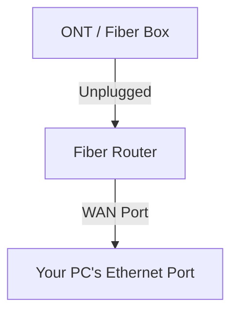
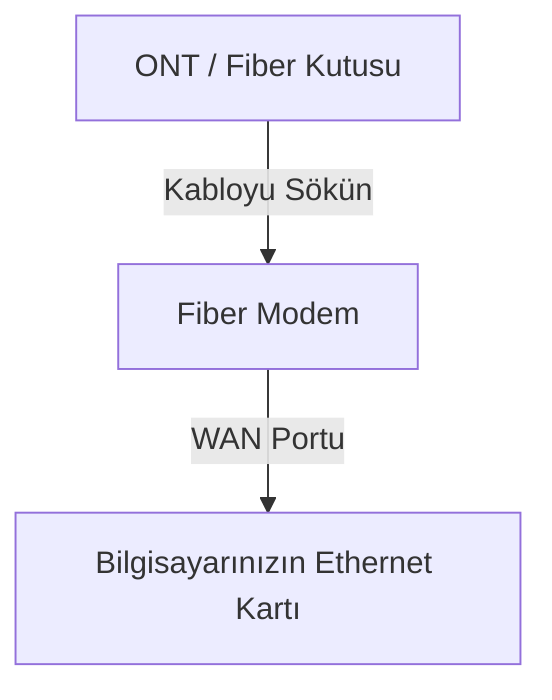

# FIBER_PASS_byHamsoTR 🔑

[English](#english) | [Türkçe](#türkçe)

---

## English

A professional, open-source, and generic desktop tool designed to recover/extract the PPPoE (WAN) credentials from your fiber internet router. This is extremely useful if you wish to bypass your ISP-provided router and configure a custom high-performance router (like Asus, Keenetic, pfSense, etc.) directly connected to your ONT (Fiber Box).

### Key Features
*   **Dual Language Support:** Instantly toggle the interface and logs between English and Turkish.
*   **Real-time Event Logging:** Deep packet inspection messages translated on-the-fly.
*   **Automatic Npcap Installer:** Detects missing packet-capturing drivers and offers a one-click automated download/install.
*   **Designed by HamsoTR:** A custom, elegant Dark Theme GUI with an intuitive workflow.
*   **100% Brand-Free:** A generic implementation suitable for any standard PPPoE-based ISP worldwide.

---

### 🌐 Physical Connection & Setup Guide

To capture the PPPoE packets, your PC must act as a middleman (or a fake authentication server) for your router.



1.  **ONT Disconnection:** Unplug the ethernet cable coming from the ONT (Fiber Box) to the router.
2.  **Local Connection:** Run a standard Ethernet cable from the **WAN port** of your router to the **Ethernet port of this PC**.
3.  **Start Listening:** Run the application with administrator privileges, select your physical Ethernet card, and click **START LISTENING**.
4.  **Reboot Router:** Power off your router using its power button, wait 5 seconds, and power it back on.
5.  **Extraction:** During boot, the router will send PPPoE Discovery packets (PADI). The tool will answer automatically and perform a fake PAP authentication handshake. The username and password will instantly appear on the right side of the screen!

---

### 🛠️ Running from Source & Compilation

#### Requirements
*   Python 3.10+
*   Admin Privileges (Windows)
*   Scapy & CustomTkinter Libraries

#### Install Dependencies
```bash
pip install scapy customtkinter pillow
```

#### Run GUI
```bash
python gui.py
```

#### Compile to Standalone EXE
You can package the project into a single executable with custom icon embedding:
```bash
pyinstaller --clean gui.spec
```
The compiled output will be generated inside the `dist/` directory as `FIBER_PASS_byHamsoTR.exe`.

---

## Türkçe

Fiber internet modeminizin/router cihazınızın WAN (PPPoE) kullanıcı adı ve şifresini güvenli bir şekilde öğrenmek/yakalamak için tasarlanmış profesyonel, açık kaynak kodlu ve evrensel bir masaüstü aracıdır. ISP (İnternet Servis Sağlayıcı) tarafından verilen varsayılan modemi aradan çıkarıp, doğrudan ONT kutunuza (Fiber Kutusu) kendi yüksek performanslı router cihazınızı (Asus, Keenetic, pfSense vb.) bağlamak istediğinizde bu şifreye ihtiyaç duyarsınız.

### Öne Çıkan Özellikler
*   **Çift Dil Desteği:** Tek tıkla tüm arayüzü ve geçmiş log kayıtlarını Türkçe / İngilizce arasında anında dönüştürün.
*   **Gerçek Zamanlı Log Çevirisi:** Paket analiz ve ağ olayları seçili dile göre anlık olarak çevrilerek loglanır.
*   **Otomatik Npcap Yükleyici:** Sisteminizde paket yakalama sürücüsü eksikse algılar ve tek tıkla otomatik olarak internetten indirip kurar.
*   **HamsoTR İmzalı Tasarım:** Tamamen karanlık mod (Dark Theme) uyumlu, kullanıcı dostu ve şık arayüz tasarımı.
*   **%100 Markasız ve Evrensel:** Dünya çapındaki tüm standart PPPoE altyapılarına uyumlu, bağımsız tasarım.

---

### 🌐 Fiziksel Bağlantı ve Kurulum Kılavuzu

Modemin PPPoE isteklerini yakalayabilmek için bilgisayarınızı modeme sahte bir kimlik doğrulama sunucusu olarak tanıtmanız gerekir.



1.  **ONT Bağlantısını Kesin:** ONT (Fiber Kutusu) ile modem arasındaki sarı/siyah ethernet kablosunu modemden sökün.
2.  **Yerel Bağlantı:** Ayrı bir ethernet kablosu ile modemin arkasındaki renkli **WAN portunu**, **bu bilgisayarın Ethernet portuna** bağlayın.
3.  **Dinlemeyi Başlatın:** Uygulamayı yönetici olarak çalıştırın, fiziksel Ethernet kartınızı listeden seçin ve **DİNLEMEYİ BAŞLAT** butonuna tıklayın.
4.  **Modemi Yeniden Başlatın:** Modemi arkasındaki güç düğmesinden kapatın, 5 saniye bekleyip tekrar açın.
5.  **Şifre Yakalama:** Modem açılırken bilgisayarınıza PPPoE istekleri (PADI) gönderecektir. Program bu istekleri sahte bir PAP el sıkışmasıyla yanıtlayacak ve şifreniz sağ taraftaki kutularda anında belirecektir!

---

### 🛠️ Kaynak Koddan Çalıştırma ve Derleme

#### Gereksinimler
*   Python 3.10+
*   Yönetici Hakları (Windows)
*   Scapy & CustomTkinter Kütüphaneleri

#### Bağımlılıkları Yükleme
```bash
pip install scapy customtkinter pillow
```

#### GUI Arayüzünü Başlatma
```bash
python gui.py
```

#### Tek Başına Çalışan EXE Olarak Derleme
Projeyi şık ve gömülü simgesiyle birlikte tek bir çalıştırılabilir dosya haline getirebilirsiniz:
```bash
pyinstaller --clean gui.spec
```
Derleme işlemi bittiğinde çalıştırılabilir dosya `dist/` klasörü altında `FIBER_PASS_byHamsoTR.exe` adıyla oluşturulacaktır.

---

### 👨‍💻 Credits / Emeği Geçenler
Designed and developed with ❤️ by **HamsoTR**.

---

<!-- 
SEO Anahtar Kelimeler / Search Keywords:
fiber şifresi öğrenme, gpon şifresi öğrenme, wan şifresi bulma, pppoe kullanıcı adı şifre öğrenme, superonline şifre bulucu, fiber şifre extractor, modem şifresi yakalama, hamsotr, fiber pass, keenetic şifre öğrenme, asus router şifre bulma, pppoe password sniffer, fiber internet şifre öğrenme, fiber pass by hamsotr, fiber şifre kırma, router şifresi öğrenme, gpon şifresi bulma
-->
